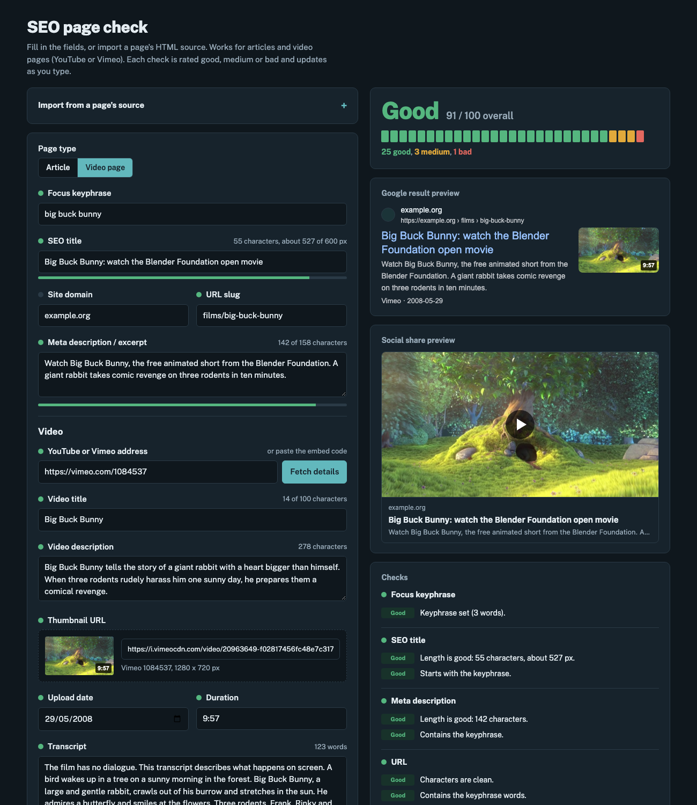

# SEO page check

A single-page tool for checking a web page's on-page SEO before you publish it, for both articles and video pages (YouTube or Vimeo). Fill in the fields, or paste a page's HTML source, and every check is rated **good**, **medium** or **bad** as you type, with live Google and social-share previews.

**[Try it online](https://thecoolsim.github.io/SEO-page-check/)**


## Features

- Checks the focus keyphrase, SEO title, meta description, URL slug, body content, featured image, alt text and tags
- Overall score out of 100, plus a verdict for each group
- Google result preview that truncates the title and description by pixel width, as Google does
- Social share card preview (Open Graph style, 1.91:1 image)
- Rich-text body editor with headings, lists, and internal and external links (colour-coded), plus an HTML view and "Copy HTML"
- Pasting from Word or a web page is cleaned down to plain paragraphs, headings, lists, bold, italic and links
- **Import from page source**: paste a page's full HTML to fill the fields and run technical checks (H1 count, canonical, Open Graph, Twitter card, `lang`, hreflang, robots `noindex`, viewport, image alt attributes)
- **Video pages**: checks the video address, title, description, chapters, thumbnail, upload date, duration, transcript and captions, and generates `VideoObject` structured data (JSON-LD) to paste into the page
- "Load an example" button for a quick demo (an article or a video page, depending on the page type)
- Light and dark themes (follows the system setting)

## Privacy

Everything runs in your browser. Nothing you type, paste or upload is sent to a server. Your last draft, including an uploaded image, is kept in the browser's `localStorage` so it survives a reload. **Clear all fields** removes it. The only external request is for the Public Sans font from Google Fonts, with two exceptions on video pages:

- The video thumbnail is loaded from its address so its size can be checked.
- **Fetch details** asks YouTube or Vimeo (their public oEmbed service) for the video's title, thumbnail and, on Vimeo, the description, upload date and duration. It only runs when you click it.

## What is checked

| Group | Checks | Good range |
|---|---|---|
| Focus keyphrase | Word count | 1–4 words |
| SEO title | Pixel width (20px Arial), character count, keyphrase at the start | 30+ characters, ≤ 600 px |
| Meta description | Length, keyphrase present | 120–158 characters |
| URL | Allowed characters, last segment length, keyphrase words | Lowercase, digits, hyphens; ≤ 75 characters |
| Content | Word count, keyphrase in first paragraph, density, subheadings, paragraph and sentence length, internal and outbound links | 300+ words; density 0.5–3%; ≤ 25% of sentences over 20 words; paragraphs ≤ 150 words |
| Featured image | Dimensions, aspect ratio, file size, format, alt text | ≥ 1200 × 630 px, about 1.91:1, ≤ 300 KB, JPEG/PNG/WebP/AVIF; alt ≤ 125 characters |
| Tags | Count, duplicates, long phrases, keyphrase match | 3–8 tags |
| Page tags (import only) | H1, canonical, Open Graph, Twitter card, `lang`, hreflang, robots, viewport, image alt attributes | One H1, all tags present |

### Video pages

Choose **Video page** as the page type to add these checks. They follow Google's [video SEO best practices](https://developers.google.com/search/docs/appearance/video) and [`VideoObject` requirements](https://developers.google.com/search/docs/appearance/structured-data/video).

| Field | Checks | Good range |
|---|---|---|
| Address | YouTube or Vimeo URL, or embed code, with a readable video ID | `watch`, `youtu.be`, `embed`, `shorts`, `live`, `youtube-nocookie`, `vimeo.com`, `player.vimeo.com` (including private-link hashes) |
| Video title | Length, keyphrase | ≤ 70 characters (YouTube's limit is 100) |
| Video description | Length, keyphrase in the first 160 characters, chapters | 100–5,000 characters; 3+ chapters starting at `0:00`, each ≥ 10 seconds |
| Thumbnail | Loads, size, 16:9 ratio, https | ≥ 1280 × 720 px. YouTube's 120 × 90 placeholder is flagged |
| Upload date | Present, valid, not in the future | Required by Google |
| Duration | Readable | `4:35`, `1:02:03`, `275` or `PT4M35S` |
| Transcript | Present, length, keyphrase | 50+ words |
| Captions | Marked as available | — |

On a video page the transcript counts towards the content length and keyphrase density, a short introduction is enough for the body, and the video thumbnail can stand in for the featured image.

**Import** switches to Video page automatically when the source has a YouTube or Vimeo `<iframe>` or `VideoObject` JSON-LD. It fills the video fields from the structured data and adds checks for required `VideoObject` properties (`name`, `thumbnailUrl`, `uploadDate`), the embed and `og:video`.

**Video structured data** (under the checks) builds a `VideoObject` JSON-LD block from the fields: name, description, thumbnail, upload date, ISO 8601 duration, embed URL, transcript, keywords (from the tags) and, when chapters are valid, `Clip` key moments with start, end and timestamped URLs. Copy it into the page and check it with Google's [Rich Results Test](https://search.google.com/test/rich-results).



Keyphrase matching ignores case and accents and matches whole words only, so "art" does not match "party".

Links are classified as internal when they are relative or point to the **Site domain** (including subdomains); everything else counts as outbound. Set the site domain to classify absolute links correctly.

The score counts good checks as 1 and medium checks as 0.5, divided by the number of checks. 80 or more is Good and 55 or more is Medium.

These thresholds are common SEO guidelines (similar to the ones Yoast and Rank Math use), not official Google rules. Treat the results as a writing checklist, not a ranking guarantee.

## Usage

### Online

Open the [GitHub Pages version](https://thecoolsim.github.io/SEO-page-check/).

### Locally

No build step and no dependencies. Download or clone the repository and open `index.html` in a browser:

```bash
git clone https://github.com/Thecoolsim/SEO-page-check.git
cd SEO-page-check
open index.html          # macOS; or double-click the file
```

### Importing a page

1. Open the page in your browser.
2. View the source: <kbd>Ctrl</kbd>+<kbd>U</kbd> on Windows or Linux, <kbd>Cmd</kbd>+<kbd>Option</kbd>+<kbd>U</kbd> on a Mac (in Safari, turn on the Develop menu first).
3. Select all, copy, and paste into **Import from a page's source**, then click **Read source**.
4. Set the focus keyphrase to complete the checks.

The body is taken from the first match of a Drupal body field, `article`, `main`, `[role=main]` or `body`. Navigation, headers, footers, forms and the H1 are removed.

## Files

| File | Description |
|---|---|
| `index.html` | Page markup |
| `seo-page-check.css` | Styles, including light and dark themes |
| `seo-page-check.js` | Checks, previews, editor and import logic |
| `docs/screenshot.png`, `docs/screenshot-video.png` | Screenshots for this README |

## Browser support

Current versions of Chrome, Edge, Firefox and Safari (16.4 or later). The page-type switch uses the CSS `:has()` selector (Firefox 121 or later). The editor uses `document.execCommand`, which is deprecated but still supported by all major browsers.

## Author

**Simon Adjatan**
- Website: https://adjatan.org/
- GitHub: https://github.com/Thecoolsim
- X: https://x.com/adjatan

## License

[MIT](LICENSE) © 2026 Simon Adjatan
